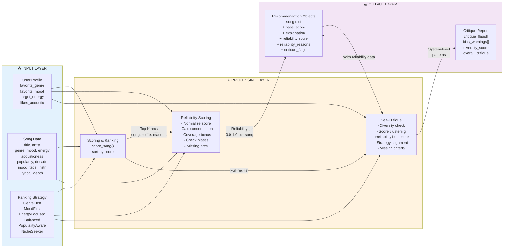
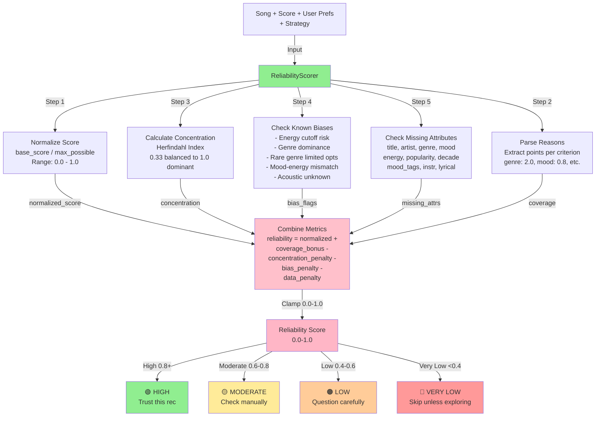
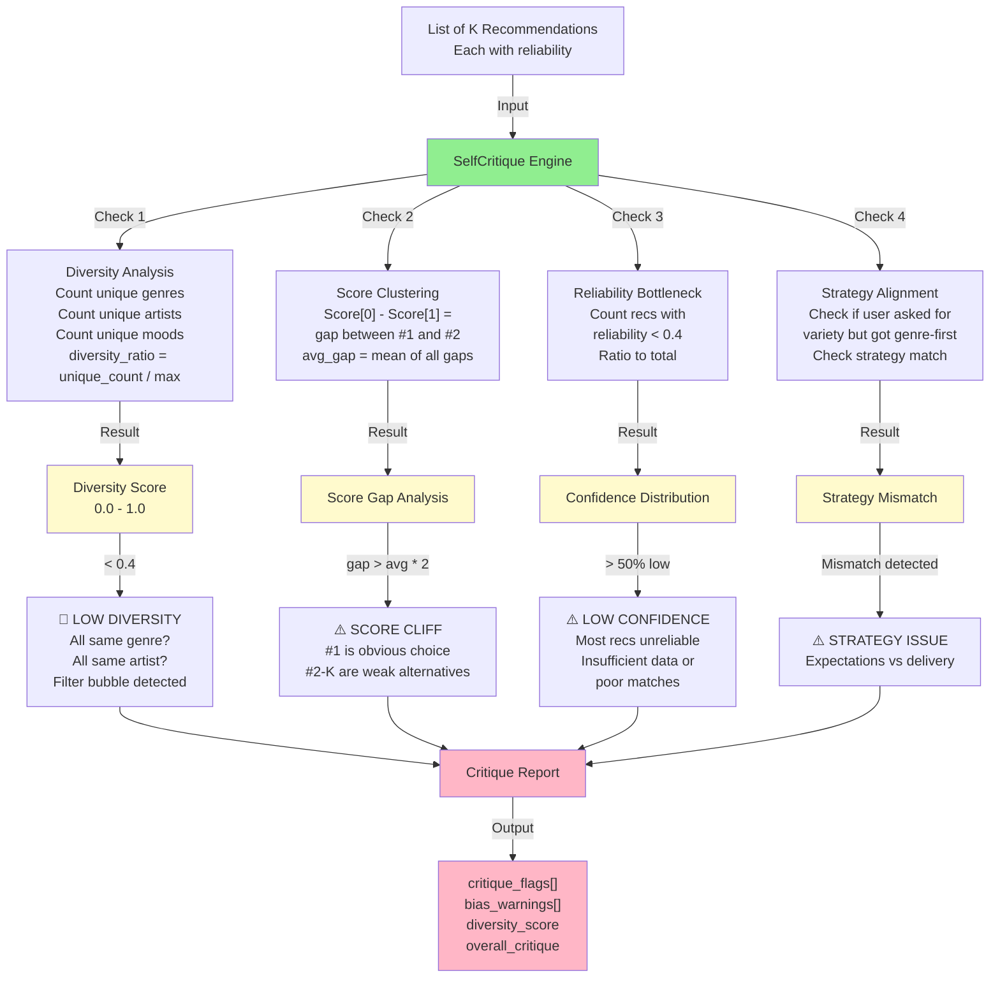
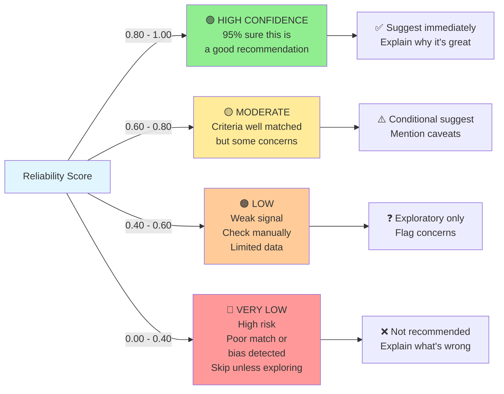
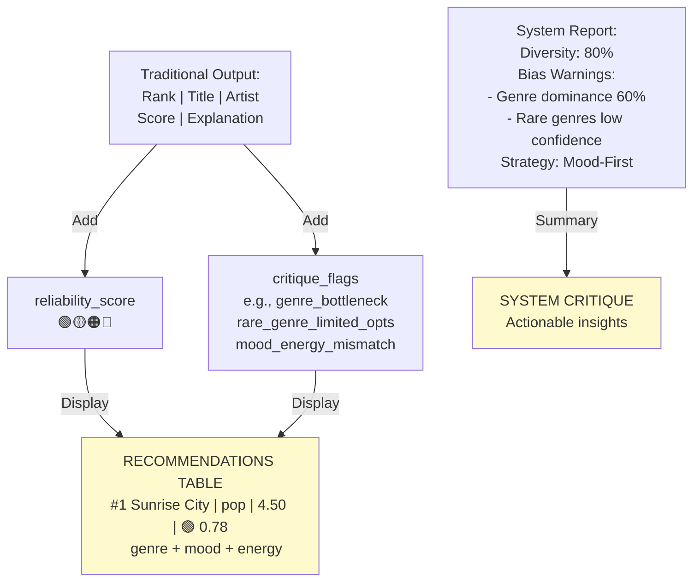

# Reliability Scoring & Self-Critique System Architecture

Complete documentation of the reliability scoring and self-critique module for the Music Recommender Simulation. These diagrams will render automatically on GitHub.

---

## 1. Main System Architecture

Complete end-to-end flow from user input through recommendation generation, reliability scoring, and critique analysis to final output.

```mermaid
graph TD
    A["👤 User Prefs"] -->|favorite_genre, mood,<br/>energy, etc.| B["📊 recommend_songs()"]
    C["🎵 Song Catalog"] -->|List[Dict]| B
    D["🎯 RankingStrategy<br/>GenreFirst, MoodFirst,<br/>EnergyFocused, etc."] -->|scoring rules| B
    
    B -->|existing pipeline| E["Scored Songs<br/>List of Song, Score, Explanation"]
    
    E -->|NEW: enable_reliability=True| F["🔍 ReliabilityScorer"]
    
    F -->|Computes 5 Metrics| G["Metric 1: Score<br/>Normalization"]
    F -->|Computes 5 Metrics| H["Metric 2: Criteria<br/>Concentration"]
    F -->|Computes 5 Metrics| I["Metric 3: Coverage<br/>Bonus"]
    F -->|Computes 5 Metrics| J["Metric 4: Bias<br/>Proximity Check"]
    F -->|Computes 5 Metrics| K["Metric 5: Missing<br/>Attributes"]
    
    G --> L["Reliability Score<br/>0.0 - 1.0"]
    H --> L
    I --> L
    J --> L
    K --> L
    
    L -->|For Each Song| M["✨ Recommendation Object<br/>song, score, explanation,<br/>reliability, flags"]
    
    E -->|Same recommendations| N["🤖 SelfCritique Engine"]
    M -->|With reliability data| N
    D -->|Strategy context| N
    A -->|User context| N
    
    N -->|4 Checks| O["Check 1: Diversity<br/>Genre/Artist/Mood Analysis"]
    N -->|4 Checks| P["Check 2: Score<br/>Clustering"]
    N -->|4 Checks| Q["Check 3: Reliability<br/>Bottleneck"]
    N -->|4 Checks| R["Check 4: Strategy<br/>Alignment"]
    
    O --> S["🚨 Critique Report<br/>critique_flags,<br/>bias_warnings,<br/>diversity_score,<br/>overall_critique"]
    P --> S
    Q --> S
    R --> S
    
    M -->|Ranked List| T["🎬 Output"]
    S --> T
    
    T -->|Display| U["📱 Enhanced Table<br/>Rank | Title | Artist | Genre | Score<br/>Reliability | Confidence Label<br/>Explanation | Flags"]
    T -->|Display| V["📋 System Critique<br/>Diversity Score<br/>Bias Warnings<br/>Missing Criteria<br/>Recommendation Tips"]
    
    style A fill:#e1f5ff
    style B fill:#fff3e0
    style C fill:#e1f5ff
    style D fill:#f3e5f5
    style E fill:#fffacd
    style F fill:#90ee90
    style L fill:#ffc0cb
    style M fill:#87ceeb
    style N fill:#90ee90
    style S fill:#ffb6c6
    style T fill:#dda0dd
    style U fill:#fffacd
    style V fill:#fffacd
```

**Key Points:**
- Wraps existing `recommend_songs()` without changing core logic
- ReliabilityScorer: 5-metric analysis per song
- SelfCritique: 4 pattern checks across all recommendations
- Output: Enhanced recommendations + system-level critique

---

## 2. Data Flow: Three-Layer Architecture

Shows how data flows through Input → Processing → Output layers.



**Layer Breakdown:**
- **Input:** User preferences, song catalog, ranking strategy
- **Processing:** Scoring, reliability calculation, critique analysis
- **Output:** Enhanced recommendations with reliability + system critique

---

## 3. ReliabilityScorer: Internal Logic

Five-step algorithm for computing reliability scores (0.0-1.0) for each recommendation.



**Scoring Formula:**
```
reliability = normalized_score + coverage_bonus - concentration_penalty - bias_penalty - data_penalty
```

**Known Biases Detected:**
- Energy cutoff hard threshold (songs outside ±0.5 energy = 0 points)
- Genre dominance risk (genre-first strategy dominates)
- Rare genre bottleneck (metal, folk, jazz = 1-2 songs only)
- Mood-energy mismatch (happy should be energetic, not chill)
- Acoustic data unknown (confidence reduced)

---

## 4. SelfCritique: Pattern Detection

Four-check analysis to identify problematic patterns in the recommendation set.



**Four System Checks:**
1. **Diversity Analysis:** Are recommendations varied or in a filter bubble?
2. **Score Clustering:** Is #1 clearly best or are scores close?
3. **Reliability Bottleneck:** Are most recommendations low-confidence?
4. **Strategy Alignment:** Does strategy match user intent?

---

## 5. Confidence Levels: User Interpretation Guide

How to interpret reliability scores and what action to recommend.



**Interpretation by Score Range:**
- **🟢 HIGH (0.80-1.00):** Multiple criteria matched, no major concerns
- **🟡 MODERATE (0.60-0.80):** Good match but some flags or data missing
- **🟠 LOW (0.40-0.60):** Weak signal, limited matches, needs manual verification
- **🔴 VERY LOW (<0.40):** High-risk recommendation, potential bias detected

---

## 6. Enhanced Output Integration

How reliability scores and critique integrate into the display.



**Enhanced Display Components:**
- **Recommendation Table:** Each recommendation shows reliability score with confidence emoji
- **Critique Flags:** Per-recommendation concerns or bias risks
- **System Report:** Diversity score, bias patterns, strategy alignment notes

---

## Example Output Format

```
====================================================
TOP 5 RECOMMENDATIONS
====================================================

Rank | Title              | Artist         | Genre    | Score | Reliability        | Explanation
-----|--------------------+----------------+----------|-------|--------------------+--------------------------------------
#1   | Sunrise City       | Pop Stars      | pop      | 4.50  | 🟢 HIGH (0.78)    | genre match (+2.0) + mood match (+0.8) + energy (+1.5) + acoustic (+0.2)
#2   | Gym Hero           | Rock Anthem    | pop      | 4.20  | 🟡 MODERATE (0.64)| genre match (+2.0) + energy (+1.8) [⚠️ mood mismatch: intense vs happy]
#3   | Rooftop Lights     | Indie Vibes    | indie    | 3.80  | 🟠 LOW (0.45)     | mood match (+0.8) + energy (+1.5) [⚠️ genre mismatch, rare genre 3 songs]
#4   | Electric Dreams    | Synth Wave     | elec     | 3.10  | 🟠 LOW (0.38)     | energy (+2.0) only [⚠️ high concentration, no genre/mood match]
#5   | Midnight Groove    | Jazz Fusion    | jazz     | 2.50  | 🔴 VERY LOW (0.22)| energy (+1.5) only [🚨 rare genre bottleneck, high bias risk]

====================================================
SYSTEM CRITIQUE
====================================================

✓ Diversity Score: 80% (Good spread across genres/artists)

⚠️ Issues Detected (2):
  - SCORE_CLIFF: Gap between #1 (4.50) and #2 (4.20) is larger than average
    → Recommendation: #1 is strong consensus, #2-5 should be reviewed more carefully
  - MISSING_CRITERIA: "Acousticness" preference never matched in any recommendation
    → Recommendation: User may want to explore acoustic variants

🚨 Bias Warnings:
  - Genre Dominance: Pop appears in 2/5 recommendations (40% of top 5)
    → This aligns with user preference for pop, but limits discovery
  - Rare Genre Bottleneck: Jazz (1 song) and Indie (2 songs) have limited options
    → System recommending from constrained catalog, consider expanding data
  - Mood-Energy Mismatch: Recommendation #2 is "intense" but user asked for "happy"
    → Genre match overcame mood preference; verify if acceptable

✅ Strategy Alignment:
  Current strategy: GenreFirstStrategy
  User intent: Find happy, pop music with high energy
  Status: ✓ ALIGNED (Genre-first is appropriate for genre-specific user)

====================================================
RECOMMENDATIONS
====================================================

✅ #1 (Sunrise City):    STRONGLY RECOMMEND – High confidence, all criteria match
⚠️  #2 (Gym Hero):        RECOMMEND WITH CAUTION – Check mood compatibility
❓  #3 (Rooftop Lights):   EXPLORATORY – Lower confidence, consider for discovery
❌ #4-5:                 SKIP UNLESS EXPLORING – Low confidence due to bias/data issues
```

---

## Implementation Roadmap

These diagrams correspond to the following Python modules (to be created):

- **`src/reliability_scorer.py`** 
  - `ReliabilityScorer` class
  - `score_reliability()` method (5-metric calculation)
  - Bias detection methods

- **`src/self_critique.py`**
  - `SelfCritique` class
  - `critique_recommendations()` method (4-check analysis)
  - Pattern detection methods

- **`src/recommender.py`** (Enhanced)
  - `Recommendation` dataclass (wraps song + metadata)
  - Modified `recommend_songs()` (adds `enable_reliability` parameter)

- **`src/main.py`** (Enhanced)
  - `display_recommendations_with_reliability()` function
  - `display_system_critique()` function

---

## Key Design Principles

✅ **Minimal Refactoring:** Wraps existing scoring, doesn't change core logic
✅ **Composable:** Can enable/disable reliability scoring per session  
✅ **Observable:** Shows *why* recommendations are trustworthy (transparency)
✅ **Educational:** Teaches users about recommender biases in real time
✅ **Extensible:** New bias checks can be added to bias detection
✅ **Testable:** Each component independently testable

---

## Related Documentation

- [BIAS_AND_FILTER_BUBBLE_ANALYSIS.md](../BIAS_AND_FILTER_BUBBLE_ANALYSIS.md) — Known system biases that reliability scoring detects
- [IMPLEMENTATION_SUMMARY.md](../IMPLEMENTATION_SUMMARY.md) — Core recommender features and strategies
- [README.md](../README.md) — Main project overview
