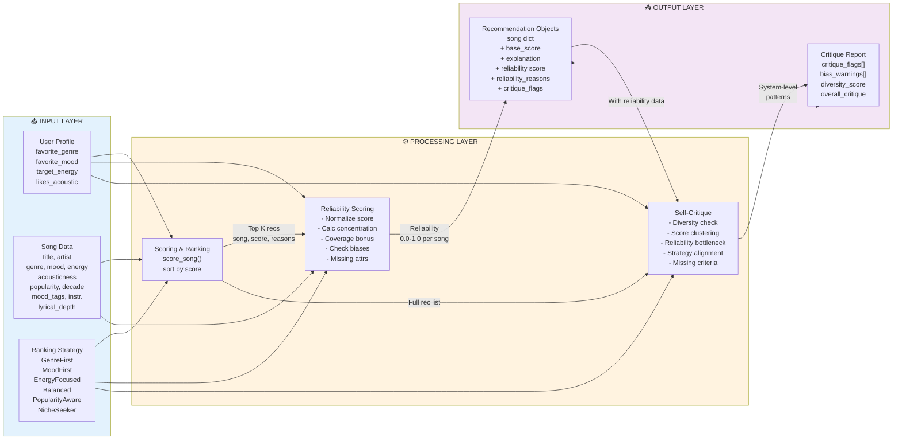
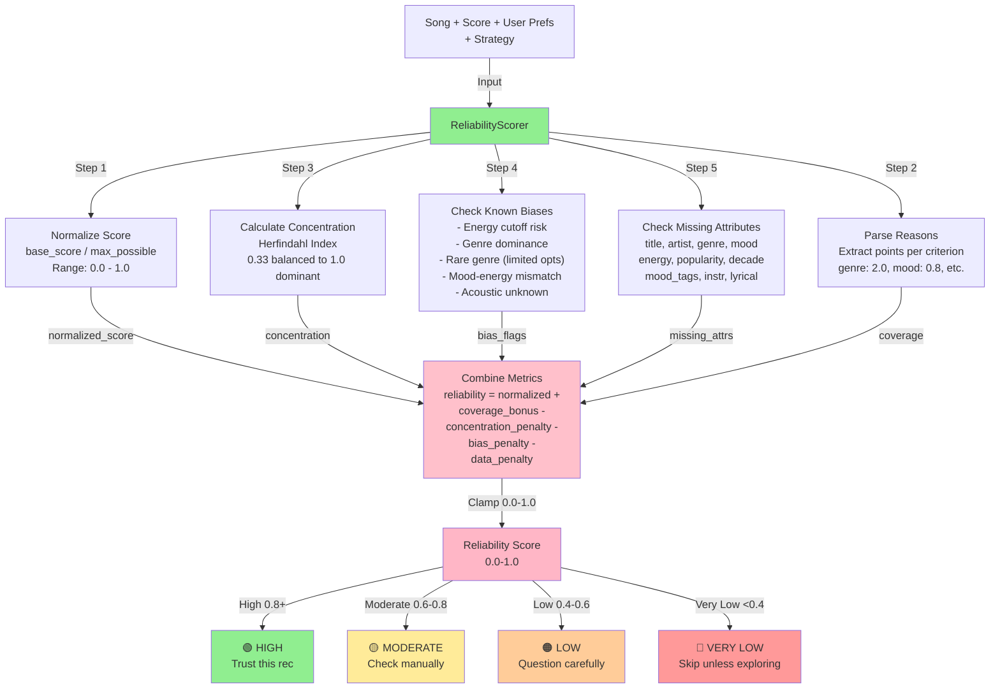
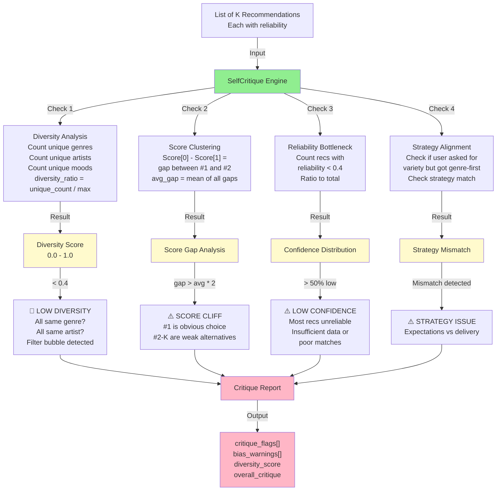
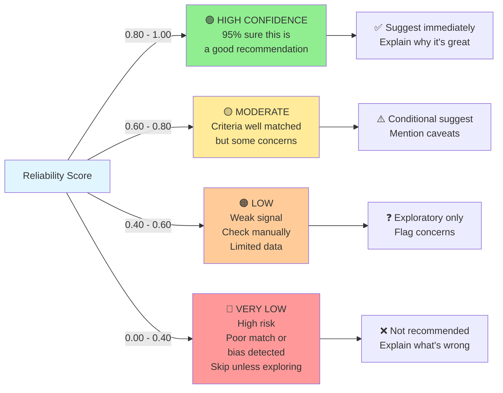
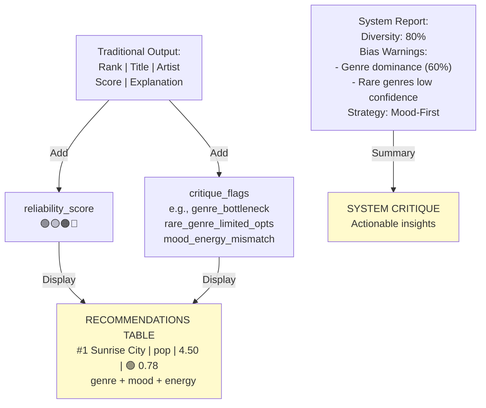

# Reliability Scoring & Self-Critique Architecture

## System Architecture Diagram

```mermaid
graph TD
    A["👤 User Prefs"] -->|favorite_genre, mood,<br/>energy, etc.| B["📊 recommend_songs()"]
    C["🎵 Song Catalog"] -->|List[Dict]| B
    D["🎯 RankingStrategy<br/>GenreFirst, MoodFirst,<br/>EnergyFocused, etc."] -->|scoring rules| B
    
    B -->|existing pipeline| E["Scored Songs<br/>List of Song, Score, Explanation"]
    
    E -->|NEW: enable_reliability=True| F["🔍 ReliabilityScorer"]
    
    F -->|Computes 5 Metrics| G["Metric 1: Score<br/>Normalization"]
    F -->|Computes 5 Metrics| H["Metric 2: Criteria<br/>Concentration"]
    F -->|Computes 5 Metrics| I["Metric 3: Coverage<br/>Bonus"]
    F -->|Computes 5 Metrics| J["Metric 4: Bias<br/>Proximity Check"]
    F -->|Computes 5 Metrics| K["Metric 5: Missing<br/>Attributes"]
    
    G --> L["Reliability Score<br/>0.0 - 1.0"]
    H --> L
    I --> L
    J --> L
    K --> L
    
    L -->|For Each Song| M["✨ Recommendation Object<br/>song, score, explanation,<br/>reliability, flags"]
    
    E -->|Same recommendations| N["🤖 SelfCritique Engine"]
    M -->|With reliability data| N
    D -->|Strategy context| N
    A -->|User context| N
    
    N -->|4 Checks| O["Check 1: Diversity<br/>Genre/Artist/Mood Analysis"]
    N -->|4 Checks| P["Check 2: Score<br/>Clustering"]
    N -->|4 Checks| Q["Check 3: Reliability<br/>Bottleneck"]
    N -->|4 Checks| R["Check 4: Strategy<br/>Alignment"]
    
    O --> S["🚨 Critique Report<br/>critique_flags,<br/>bias_warnings,<br/>diversity_score,<br/>overall_critique"]
    P --> S
    Q --> S
    R --> S
    
    M -->|Ranked List| T["🎬 Output"]
    S --> T
    
    T -->|Display| U["📱 Enhanced Table<br/>Rank | Title | Artist | Genre | Score<br/>Reliability | Confidence Label<br/>Explanation | Flags"]
    T -->|Display| V["📋 System Critique<br/>Diversity Score<br/>Bias Warnings<br/>Missing Criteria<br/>Recommendation Tips"]
    
    style A fill:#e1f5ff
    style B fill:#fff3e0
    style C fill:#e1f5ff
    style D fill:#f3e5f5
    style E fill:#fffacd
    style F fill:#90ee90
    style L fill:#ffc0cb
    style M fill:#87ceeb
    style N fill:#90ee90
    style S fill:#ffb6c6
    style T fill:#dda0dd
    style U fill:#fffacd
    style V fill:#fffacd
```

---

## Data Flow: Detailed Layer Breakdown



---

## ReliabilityScorer: Internal Logic



---

## SelfCritique: Pattern Detection



---

## Confidence Labels & User Interpretation



---

## Integration: Enhanced Output


